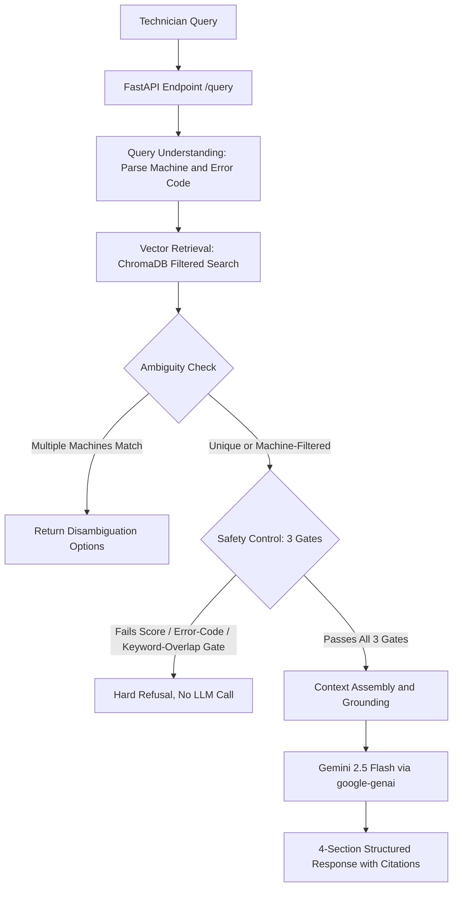

# MachineAssist — RAG-Based Intelligent Machine Troubleshooting System

**VH26-TEAM_HARMONY · Application Data Management (RAG)**

A retrieval-augmented troubleshooting assistant for factory technicians. It ingests multiple machine manuals, resolves conflicting/overlapping error codes across machines, retrieves the right information with citations, and refuses to answer when the manuals don't support an answer.

This is **not** a basic "chat with PDF" app. It is explicitly designed to handle:
- **The same error code meaning different things across different machines**
- **Ambiguous queries** that need clarification before answering
- **Hallucination control** — a real, three-gate mechanism, not just a prompt instruction
- **Full traceability**: every answer cites manual, section, and machine

**Status:** Backend (Phases 0–8) implemented and verified against all 4 required demo cases. See [Section 6: Demo Verification Matrix](#6-demo-verification-matrix).

---

## 1. System Architecture



**Pipeline order:**
`parse_query` → `retrieve` → `check_ambiguity` → *(if ambiguous: return options, stop)* → `safety gates` → *(if insufficient: hard refusal, stop)* → `assemble_context` → `generate_answer` → `update memory` → `return answer + sources`

> **The core design principle:** Retrieve first, generate second, never invent. The LLM only writes prose from grounded context — it never decides facts, and it's never called at all when the safety gates fail.

---

## 2. Tech Stack

| Component | Choice |
|---|---|
| **Language** | Python 3.10+ |
| **Text/manual ingestion** | Custom parser, `SECTION:`-delimited (see `src/ingest.py`) |
| **Embeddings** | `sentence-transformers` (`all-MiniLM-L6-v2`) — local, free, no API key |
| **Vector DB** | ChromaDB, persistent, cosine distance, stored at `./chroma_db` |
| **LLM** | Gemini 2.5 Flash via the `google-genai` SDK (`GEMINI_API_KEY` required) |
| **Backend API** | FastAPI (`src/api.py`) |
| **Frontend UI** | React (built separately — see [Section 8: Frontend Integration](#8-frontend-integration)) |
| **Session memory** | In-memory per-`session_id` store (`src/memory.py`) |

> **Note:** Embeddings are local and free; only the generation step needs an API key, since answer quality matters more than embedding quality here.

---

## 3. Project Structure

```
machineassist/
├── data/
│   └── manuals/              # source manuals (txt), one per machine
│       ├── cnc100.txt
│       ├── press200.txt
│       └── robotarm300.txt
├── src/
│   ├── ingest.py             # Phase 1: parse SECTION: blocks + metadata tagging
│   ├── embed_store.py        # Phase 2: sentence-transformers embeddings + Chroma store
│   ├── query_understanding.py# Phase 3: extract machine/error_code from query
│   ├── retrieval.py          # Phase 4: metadata-filtered, scored retrieval
│   ├── disambiguation.py     # Phase 5: detect + resolve cross-manual ambiguity
│   ├── safety.py             # Phase 6: three-gate hallucination control
│   ├── llm_answer.py         # Phase 7: context assembly + Gemini generation
│   ├── memory.py             # Phase 8: per-session conversation state
│   └── api.py                # Phase 8: FastAPI backend, exposes the pipeline over HTTP
├── chroma_db/                # persisted vector store (generated, not committed)
├── frontend/                 # React app — built separately, see Section 8
├── tests/
│   └── test_all_demos.py     # the 4 required demo cases, automated
├── DESIGN.md                 # full phased build plan for the IDE/agent to follow
├── requirements.txt
└── README.md
```

---

## 4. Setup

```bash
python -m venv venv
source venv/bin/activate        # Windows: venv\Scripts\activate
pip install -r requirements.txt
export GEMINI_API_KEY=...       # Windows PowerShell: $env:GEMINI_API_KEY="..."
```

`sentence-transformers` downloads its model (`all-MiniLM-L6-v2`) automatically on first run — no API key required for embeddings or retrieval.

---

## 5. Running

```bash
uvicorn src.api:app --reload --port 8000
```

- **`POST /query`** — primary RAG endpoint.  
  Body: `{"message": "...", "session_id": "..."}`  
  Response: `{"answer": "...", "sources": [...], "ambiguous": false, "options": []}`
- **`GET /health`** — health check endpoint

Test either endpoint via `curl` or FastAPI's built-in Swagger UI at `http://localhost:8000/docs` before wiring up the frontend.

---

## 6. Demo Verification Matrix

All 4 required demo cases pass end-to-end (`tests/test_all_demos.py`):

| Demo Case | Query | Machine Identified | Pipeline Behavior | Result |
|---|---|---|---|:---:|
| **1. Exact error code** | *"What does E101 mean on CNC-100?"* | CNC-100 | Retrieved CNC-100's E101 chunks; generated 4-section answer (meaning, causes, steps, sources) | ✅ PASS |
| **2. Natural language symptom** | *"Why is Press-200 stopping due to oil pressure?"* | Press-200 | Semantic retrieval found Press-200's E101 chunk (*"hydraulic oil pressure low"*) with no exact keyword match on the code | ✅ PASS |
| **3. Cross-manual ambiguity** | *"What does E101 mean?"* | None specified | Flagged `ambiguous: true`; returned CNC-100 vs Press-200 as clickable options instead of guessing | ✅ PASS |
| **4. Insufficient information** | *"How do I replace spindle bearing on CNC-100?"* | CNC-100 | Safety Gate 3 (keyword overlap) failed — 0% overlap for "bearing"/"replace"; hard refusal returned, LLM never called | ✅ PASS |

---

## 7. Hallucination Control — the Three-Gate Safety System

A plain *"please don't hallucinate"* instruction to the LLM isn't a real safeguard — it's a request the model can still ignore under pressure. Instead, `src/safety.py` gates every query through three independent checks before the LLM is ever invoked:

1. **Similarity score gate** — The top retrieved chunk's relevance score must be **≥ 0.40**. Below that, the manuals likely don't cover the topic.
2. **Error-code verification gate** — If the query names an explicit error code (e.g. `E101`), that code must actually appear in the retrieved chunks. Prevents the system from answering about a code it never actually found.
3. **Content keyword overlap gate** — At least **50%** of the query's core content tokens (e.g., `bearing`, `replace`) must appear in the retrieved manual text. Catches queries that are topically adjacent but not actually documented.

If any gate fails, the system short-circuits to a fixed refusal string and **does not call the LLM at all** — this both guarantees no invented answer and saves generation cost:

> *"The available manuals do not provide sufficient information to answer this. I won't provide an unsupported answer."*

---

## 8. Frontend Integration

The frontend is a separate React app that talks to the Python backend over HTTP:

- **`session_id`** lets the backend track conversation memory (Phase 8) per browser tab, so a follow-up like *"what if that doesn't work?"* reuses the previous machine/error context without the frontend managing any RAG state itself.
- **Enable CORS** in FastAPI so the React dev server (typically `localhost:3000` or `5173`) can call the backend (typically `localhost:8000`) during development.
- **Contract Agreement:** Agree on the exact JSON request/response shape with the frontend teammate early so backend and frontend can be built fully in parallel.
- See `FRONTEND_DESIGN.md` for the UI/UX spec — layout, component states (answer / ambiguity / refusal cards), and copy guidelines.

---

## 9. How to Build This

See [`DESIGN.md`](./DESIGN.md) for the full phased build plan (Phase 0 → Phase 8). Each phase has its own acceptance criteria and should be fully working before the next one starts — this is how the backend above was actually built and verified.

---

## 10. The 4 Required Demo Cases

1. **Exact error code** — `E101` on a named machine → correct machine-specific answer
2. **Natural language symptom** — *"why is Machine A overheating?"* → semantic retrieval finds the right chunk despite no exact keyword match
3. **Cross-manual ambiguity** — `E101` with no machine specified, where 2+ machines define it differently → system asks which machine instead of guessing
4. **Insufficient information** — a question with no documented answer → system explicitly refuses rather than inventing a fix

See `tests/test_all_demos.py` for the exact scripted queries and expected behavior.
